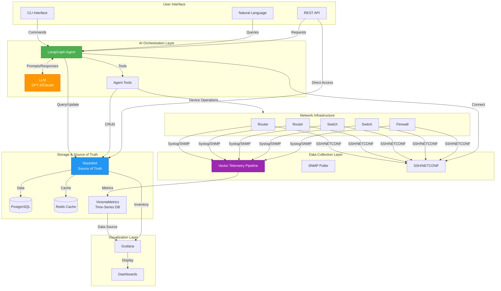

# Convergence Architecture

This document provides a detailed architectural overview of the Convergence AI-Driven Network Observability and Automation platform.

## Table of Contents
- [High-Level Architecture](#high-level-architecture)
- [Component Details](#component-details)
- [Data Flows](#data-flows)
- [AI Agent Architecture](#ai-agent-architecture)
- [Network Diagram](#network-diagram)
- [Technology Stack](#technology-stack)

---

## High-Level Architecture



---

## Component Details

### 1. Network Infrastructure Layer

The devices being managed and monitored.

**Components:**
- **Network Devices**: Routers, switches, firewalls
- **Protocols**: SSH, NETCONF, SNMP, Syslog
- **Vendors**: Cisco (IOS, NX-OS), Arista (EOS), Juniper (JunOS)

**Responsibilities:**
- Generate telemetry data (logs, metrics, traps)
- Accept configuration changes
- Report status and health

---

### 2. Data Collection Layer

Gathers telemetry and state information from network devices.

#### Vector Telemetry Pipeline
```
┌─────────────┐
│   Devices   │
└──────┬──────┘
       │ Syslog (UDP 514)
       │ SNMP Traps (UDP 162)
       │ Streaming (gRPC 9000)
       ▼
┌─────────────┐
│   Vector    │──────► Parse & Transform
└──────┬──────┘
       │ Prometheus Format
       ▼
┌─────────────┐
│ VictoriaM   │
│  Metrics    │
└─────────────┘
```

**Data Sources:**
- **Syslog**: UDP port 514 (log messages)
- **SNMP Traps**: UDP port 162 (events)
- **Streaming Telemetry**: gRPC port 9000 (gNMI, MDT)

**Processing:**
- Parse log formats
- Extract metrics
- Normalize data
- Add labels/tags
- Forward to VictoriaMetrics

#### SSH/NETCONF Connector
**Purpose:** Direct device interaction for the AI agent

**Operations:**
- Execute CLI commands
- Retrieve configurations
- Apply configuration changes
- Gather device facts

---

### 3. Storage & Source of Truth Layer

Persistent storage for network state and metrics.

#### Nautobot (Source of Truth)
```
┌──────────────────────────────────┐
│          Nautobot                │
├──────────────────────────────────┤
│  • Device Inventory              │
│  • IP Address Management (IPAM)  │
│  • Sites & Locations             │
│  • Relationships & Topology      │
│  • Configuration Context         │
│  • Custom Data & Plugins         │
└──────────────────────────────────┘
         │                    │
         ▼                    ▼
    PostgreSQL            Redis Cache
```

**Data Stored:**
- Device inventory (name, model, serial, location)
- Network topology (connections, cables)
- IP addressing (subnets, IPs, VLANs)
- Configuration context (templates, variables)
- Custom attributes and metadata

**Plugins (Phase 2):**
- Device Onboarding: Automated discovery
- Golden Config: Config management
- Device Lifecycle: Hardware lifecycle tracking

#### VictoriaMetrics (Time-Series Database)
**Purpose:** Store and query metrics data

**Metrics Stored:**
- Interface statistics (utilization, errors, discards)
- Device health (CPU, memory, temperature)
- Network performance (latency, packet loss)
- Application metrics (services, processes)

**Features:**
- Prometheus-compatible
- High compression ratio
- Fast queries
- Long-term retention (configurable)

---

### 4. AI Orchestration Layer

The intelligence layer that automates network operations.

#### LangGraph Agent Architecture

```
┌─────────────────────────────────────────────────┐
│              LangGraph Agent                    │
├─────────────────────────────────────────────────┤
│                                                 │
│  ┌─────────────┐         ┌─────────────┐      │
│  │   Router    │────────►│   Planner   │      │
│  │   (Entry)   │         └──────┬──────┘      │
│  └─────────────┘                │             │
│                                  ▼             │
│                         ┌─────────────┐       │
│                         │  Tool Node  │       │
│                         └──────┬──────┘       │
│                                │              │
│       ┌────────────────────────┼──────┐      │
│       ▼                        ▼      ▼      │
│  ┌─────────┐          ┌─────────────────┐   │
│  │Nautobot │          │  Device Tools   │   │
│  │  Tools  │          │  - SSH Connect  │   │
│  │         │          │  - Run Command  │   │
│  └─────────┘          │  - Get Facts    │   │
│                       │  - Backup       │   │
│                       └─────────────────┘   │
│                                              │
│  ┌──────────────────────────────────┐      │
│  │     State Management             │      │
│  │  - Current task                  │      │
│  │  - Message history               │      │
│  │  - Iteration count               │      │
│  └──────────────────────────────────┘      │
│                                              │
└──────────────────────────────────────────────┘
         │                          │
         ▼                          ▼
    ┌──────┐                  ┌─────────┐
    │  LLM │                  │ Network │
    │ GPT-4│                  │ Devices │
    └──────┘                  └─────────┘
```

**Agent Capabilities:**
1. **Natural Language Understanding**: Parse user intents
2. **Tool Selection**: Choose appropriate tools for tasks
3. **Execution Planning**: Break down complex operations
4. **Error Handling**: Retry logic and error recovery
5. **Result Synthesis**: Aggregate and explain outcomes

**Agent Tools:**

| Tool | Purpose | Example |
|------|---------|---------|
| `get_device` | Fetch device info from Nautobot | Get router-01 details |
| `list_devices` | Query device inventory | List all switches in HQ |
| `onboard_device` | Discover and add device | Onboard 192.168.1.1 |
| `run_command` | Execute CLI command | Show version on device |
| `backup_config` | Save configuration | Backup router configs |
| `compare_config` | Detect drift | Compare running vs golden |

---

### 5. Visualization Layer

Dashboards and monitoring interfaces.

#### Grafana Architecture

```
┌─────────────────────────────────────┐
│           Grafana                   │
├─────────────────────────────────────┤
│                                     │
│  ┌────────────────────────────┐    │
│  │     Dashboards             │    │
│  ├────────────────────────────┤    │
│  │  • Network Overview        │    │
│  │  • Device Health           │    │
│  │  • Interface Statistics    │    │
│  │  • Capacity Planning       │    │
│  │  • SLA Monitoring          │    │
│  └────────────────────────────┘    │
│                                     │
│  ┌────────────────────────────┐    │
│  │     Data Sources           │    │
│  ├────────────────────────────┤    │
│  │  • VictoriaMetrics         │    │
│  │  • Nautobot (via API)      │    │
│  └────────────────────────────┘    │
│                                     │
│  ┌────────────────────────────┐    │
│  │     Alerting               │    │
│  ├────────────────────────────┤    │
│  │  • Alert Rules             │    │
│  │  • Notification Channels   │    │
│  │  • Escalation Policies     │    │
│  └────────────────────────────┘    │
└─────────────────────────────────────┘
```

**Features:**
- Pre-built dashboards
- Custom visualizations
- Real-time metrics
- Historical analysis
- Alert management

---

## Data Flows

### 1. Device Discovery Flow

```
┌──────┐
│ User │ "Discover 192.168.1.1"
└───┬──┘
    │
    ▼
┌────────────────┐
│ AI Agent       │ Parse intent
│ (LangGraph)    │
└───┬────────────┘
    │
    ▼
┌────────────────┐
│ onboard_device │ Call tool
│ tool           │
└───┬────────────┘
    │
    ├──► Connect via SSH
    │    Get facts (version, serial, interfaces)
    │
    ▼
┌────────────────┐
│ Nautobot API   │ Create device record
└───┬────────────┘
    │
    ▼
┌────────────────┐
│ PostgreSQL     │ Store device data
└────────────────┘
    │
    ▼
┌────────────────┐
│ Agent          │ Confirm success
└───┬────────────┘
    │
    ▼
┌──────┐
│ User │ "Device discovered: router-01"
└──────┘
```

### 2. Metrics Collection Flow

```
┌────────┐
│ Router │ Generate syslog/metrics
└───┬────┘
    │ UDP 514 (Syslog)
    │ UDP 162 (SNMP)
    ▼
┌────────────┐
│   Vector   │ Parse & transform
└─────┬──────┘
      │ HTTP POST
      ▼
┌────────────────┐
│ VictoriaMetrics│ Store metrics
└─────┬──────────┘
      │ PromQL Query
      ▼
┌────────────┐
│  Grafana   │ Visualize
└────────────┘
```

### 3. Configuration Management Flow

```
┌──────┐
│ User │ "Backup all device configs"
└───┬──┘
    │
    ▼
┌────────────────┐
│ AI Agent       │ Plan: List devices, backup each
└───┬────────────┘
    │
    ▼
┌────────────────┐
│ list_devices   │ Query Nautobot
└───┬────────────┘
    │
    ▼
┌────────────────┐
│ For each device│
│ backup_config  │ SSH → show run → save to Git
└───┬────────────┘
    │
    ▼
┌────────────────┐
│ Git Repository │ Store configs with versioning
└───┬────────────┘
    │
    ▼
┌──────┐
│ User │ "Backed up 15 devices"
└──────┘
```

### 4. Alert → Investigation → Remediation Flow

```
┌────────────┐
│  Grafana   │ Alert: High CPU on router-01
└─────┬──────┘
      │
      ▼
┌────────────────┐
│ AI Agent       │ Triggered by alert
└───┬────────────┘
    │
    ├──► get_device_facts: Check CPU/memory
    │
    ├──► run_command: "show processes cpu sorted"
    │
    ├──► Analyze: Identify high CPU process
    │
    ├──► run_command: Kill/restart process OR
    │    notify_admin: Escalate if critical
    │
    ▼
┌────────────┐
│  Report    │ "Remediated: Restarted BGP process"
└────────────┘
```

---

## AI Agent Architecture

### Agent State Machine

```
┌─────────────┐
│   START     │
│  (User      │
│  Request)   │
└──────┬──────┘
       │
       ▼
┌─────────────────┐
│  Parse Intent   │ Understand what user wants
└──────┬──────────┘
       │
       ▼
┌─────────────────┐
│  Select Tools   │ Choose appropriate tools
└──────┬──────────┘
       │
       ▼
┌─────────────────┐
│  Execute Tools  │ Run device/Nautobot operations
└──────┬──────────┘
       │
       ▼
    ┌──┴──┐
    │  ?  │ Success?
    └──┬──┘
       │
    Yes│       No
       │       │
       │       ▼
       │    ┌─────────────┐
       │    │  Retry or   │
       │    │  Error      │
       │    │  Handling   │
       │    └──────┬──────┘
       │           │
       │           ▼
       │    ┌─────────────┐
       │    │  Max        │
       │◄───┤  Iterations?│
       │    └─────────────┘
       │
       ▼
┌─────────────────┐
│ Synthesize      │ Explain results
│ Response        │
└──────┬──────────┘
       │
       ▼
┌─────────────┐
│   END       │
│  (User      │
│  Response)  │
└─────────────┘
```

### Tool Execution Pattern

```python
# Pseudo-code for agent tool execution

def agent_loop(user_query):
    state = {
        "messages": [HumanMessage(user_query)],
        "iteration": 0,
        "max_iterations": 10
    }

    while state["iteration"] < state["max_iterations"]:
        # LLM decides next action
        response = llm.invoke(state["messages"])

        if response.has_tool_calls():
            # Execute tools
            for tool_call in response.tool_calls:
                tool_result = execute_tool(
                    tool_call.name,
                    tool_call.args
                )
                state["messages"].append(tool_result)
        else:
            # Final answer
            return response.content

        state["iteration"] += 1

    return "Max iterations reached"
```

---

## Network Diagram

### Physical Topology

```
                Internet
                    │
                    │
            ┌───────┴───────┐
            │   Firewall    │
            └───────┬───────┘
                    │
            ┌───────┴───────┐
            │  Core Router  │
            └───┬───────┬───┘
                │       │
        ┌───────┘       └───────┐
        │                       │
┌───────┴───────┐       ┌───────┴───────┐
│ Distribution  │       │ Distribution  │
│   Switch 1    │       │   Switch 2    │
└───┬───────┬───┘       └───┬───────┬───┘
    │       │               │       │
┌───┘       └───┐       ┌───┘       └───┐
│               │       │               │
Access SW1   Access SW2  Access SW3   Access SW4
│               │       │               │
Devices      Devices  Devices       Devices


     All devices send telemetry to:
     ┌──────────────────────────┐
     │  Convergence Platform    │
     │  ┌────────────────────┐  │
     │  │  Vector Pipeline   │  │
     │  │  VictoriaMetrics   │  │
     │  │  Grafana           │  │
     │  │  Nautobot          │  │
     │  │  AI Agent          │  │
     │  └────────────────────┘  │
     └──────────────────────────┘
```

### Logical Architecture

```
┌────────────────────────────────────────────────────────┐
│                    User Layer                          │
│  ┌──────────┐  ┌──────────┐  ┌──────────┐            │
│  │   CLI    │  │  Web UI  │  │   API    │            │
│  └──────────┘  └──────────┘  └──────────┘            │
└────────────────┬───────────────────────────────────────┘
                 │
┌────────────────┴───────────────────────────────────────┐
│               Intelligence Layer                        │
│  ┌──────────────────────────────────────────────┐     │
│  │           LangGraph AI Agent                 │     │
│  │  • Natural Language Processing               │     │
│  │  • Task Planning & Execution                 │     │
│  │  • Error Handling & Retry Logic              │     │
│  └──────────────────────────────────────────────┘     │
└────────────────┬───────────────────────────────────────┘
                 │
┌────────────────┴───────────────────────────────────────┐
│              Orchestration Layer                       │
│  ┌──────────────┐  ┌──────────────┐  ┌─────────────┐ │
│  │   Nautobot   │  │    Vector    │  │  Grafana    │ │
│  │  (SOT & API) │  │  (Pipeline)  │  │  (Viz)      │ │
│  └──────────────┘  └──────────────┘  └─────────────┘ │
└────────────────┬───────────────────────────────────────┘
                 │
┌────────────────┴───────────────────────────────────────┐
│                Storage Layer                           │
│  ┌──────────┐  ┌──────────┐  ┌──────────────────┐    │
│  │Postgres  │  │  Redis   │  │ VictoriaMetrics  │    │
│  └──────────┘  └──────────┘  └──────────────────┘    │
└────────────────┬───────────────────────────────────────┘
                 │
┌────────────────┴───────────────────────────────────────┐
│              Network Infrastructure                    │
│  ┌────────┐  ┌────────┐  ┌────────┐  ┌────────┐      │
│  │Router 1│  │Router 2│  │Switch 1│  │Switch 2│  ... │
│  └────────┘  └────────┘  └────────┘  └────────┘      │
└────────────────────────────────────────────────────────┘
```

---

## Technology Stack

### Infrastructure Services

| Component | Technology | Version | Purpose |
|-----------|-----------|---------|---------|
| Source of Truth | Nautobot | 3.0.5 | Network inventory & DCIM |
| Database | PostgreSQL | 15 | Relational data storage |
| Cache | Redis | 7 | Session & query caching |
| Metrics DB | VictoriaMetrics | Latest | Time-series metrics |
| Telemetry | Vector | Latest | Log/metric pipeline |
| Visualization | Grafana | Latest | Dashboards & alerting |

### AI Agent Stack

| Component | Technology | Version | Purpose |
|-----------|-----------|---------|---------|
| Agent Framework | LangGraph | 0.2+ | Agent orchestration |
| LLM Integration | LangChain | 0.3+ | LLM abstraction |
| LLM Provider | OpenAI/Anthropic | Latest | GPT-4 or Claude |
| Device Connectivity | Netmiko | 4.3+ | SSH connections |
| Automation Framework | Nornir | 3.4+ | Multi-device operations |
| API Client | Pynautobot | 3.0+ | Nautobot integration |
| CLI Framework | Typer | 0.12+ | Command-line interface |

### Development Tools

| Component | Technology | Purpose |
|-----------|-----------|---------|
| Testing | pytest | Unit & integration tests |
| Coverage | pytest-cov | Code coverage tracking |
| Linting | Ruff | Code linting |
| Formatting | Black | Code formatting |
| Type Checking | mypy | Static type checking |
| Security | Bandit & Safety | Security scanning |
| CI/CD | GitHub Actions | Automated testing & release |

---

## Deployment Architecture

### Single-Host Deployment (Development)

```
┌────────────────────────────────────────────┐
│          Docker Host (WSL2/Linux)          │
├────────────────────────────────────────────┤
│                                            │
│  Docker Compose                            │
│  ┌──────────────────────────────────────┐ │
│  │  convergence_network (bridge)        │ │
│  │                                      │ │
│  │  ┌────────┐  ┌────────┐  ┌───────┐ │ │
│  │  │Nautobot│  │Vector  │  │Grafana│ │ │
│  │  └────────┘  └────────┘  └───────┘ │ │
│  │  ┌────────┐  ┌────────┐  ┌───────┐ │ │
│  │  │Postgres│  │ Redis  │  │VictM  │ │ │
│  │  └────────┘  └────────┘  └───────┘ │ │
│  └──────────────────────────────────────┘ │
│                                            │
│  Python Virtual Environment                │
│  ┌──────────────────────────────────────┐ │
│  │  AI Agent                            │ │
│  │  (runs on host)                      │ │
│  └──────────────────────────────────────┘ │
└────────────────────────────────────────────┘
           │
           ▼
    Network Devices
```

### Production Deployment (Future)

```
┌─────────────────────────────────────────────────────┐
│              Load Balancer / Ingress                │
└────────────┬───────────────────────┬────────────────┘
             │                       │
┌────────────┴──────────┐  ┌────────┴─────────────┐
│   Application Tier    │  │   Application Tier   │
│  ┌─────────────────┐  │  │  ┌─────────────────┐ │
│  │  Nautobot (HA)  │  │  │  │  Nautobot (HA)  │ │
│  │  AI Agent (HA)  │  │  │  │  AI Agent (HA)  │ │
│  │  Grafana        │  │  │  │  Grafana        │ │
│  └─────────────────┘  │  │  └─────────────────┘ │
└───────────┬───────────┘  └──────────┬───────────┘
            │                          │
            └────────────┬─────────────┘
                         │
┌────────────────────────┴────────────────────────┐
│              Data Tier (Clustered)              │
│  ┌──────────────┐  ┌──────────────┐  ┌───────┐│
│  │  PostgreSQL  │  │    Redis     │  │Vector ││
│  │  (Primary +  │  │  (Sentinel)  │  │(HA)   ││
│  │   Replicas)  │  │              │  │       ││
│  └──────────────┘  └──────────────┘  └───────┘│
└─────────────────────────────────────────────────┘
            │
┌───────────┴───────────────────────────────────┐
│        Metrics Storage (Clustered)            │
│  ┌─────────────────────────────────────────┐ │
│  │    VictoriaMetrics Cluster              │ │
│  │  (vminsert + vmstorage + vmselect)      │ │
│  └─────────────────────────────────────────┘ │
└───────────────────────────────────────────────┘
```

---

## Security Architecture

```
┌──────────────────────────────────────────┐
│           Security Layers                │
├──────────────────────────────────────────┤
│                                          │
│  1. Authentication & Authorization       │
│     • API Token Authentication           │
│     • RBAC in Nautobot                   │
│     • Secrets Management (Vault)         │
│                                          │
│  2. Network Security                     │
│     • Firewall rules                     │
│     • Network segmentation               │
│     • TLS/SSL encryption                 │
│                                          │
│  3. Application Security                 │
│     • Input validation                   │
│     • SQL injection prevention           │
│     • XSS protection                     │
│                                          │
│  4. Data Security                        │
│     • Encryption at rest                 │
│     • Encryption in transit              │
│     • Credential encryption              │
│                                          │
│  5. Audit & Compliance                   │
│     • Action logging                     │
│     • Change tracking                    │
│     • Compliance reporting               │
│                                          │
└──────────────────────────────────────────┘
```

---

## Scalability Considerations

### Horizontal Scaling

| Component | Scaling Strategy |
|-----------|-----------------|
| AI Agent | Multiple agent instances with load balancing |
| Nautobot | Multiple application servers behind load balancer |
| VictoriaMetrics | Cluster mode (vminsert, vmstorage, vmselect) |
| Vector | Multiple vector instances for different device groups |
| Grafana | Multiple Grafana instances (shared database) |

### Vertical Scaling

| Resource | Recommendation |
|----------|---------------|
| PostgreSQL | Increase memory for query caching |
| VictoriaMetrics | Increase disk for longer retention |
| AI Agent | Increase CPU for faster LLM responses |

---

## Future Enhancements

1. **Multi-Tenancy**: Support for multiple organizations
2. **Advanced Analytics**: ML-based anomaly detection
3. **Self-Healing**: Autonomous remediation without human approval
4. **Mobile App**: iOS/Android interface
5. **Voice Interface**: Alexa/Google Home integration
6. **Compliance Automation**: Automated compliance checking and reporting
7. **Predictive Maintenance**: Predict device failures before they occur

---

## References

- [Nautobot Documentation](https://docs.nautobot.com/)
- [LangGraph Documentation](https://langchain-ai.github.io/langgraph/)
- [VictoriaMetrics Documentation](https://docs.victoriametrics.com/)
- [Vector Documentation](https://vector.dev/docs/)
- [Grafana Documentation](https://grafana.com/docs/)

---

*Last Updated: 2026-01-31*
*Version: 1.0*
