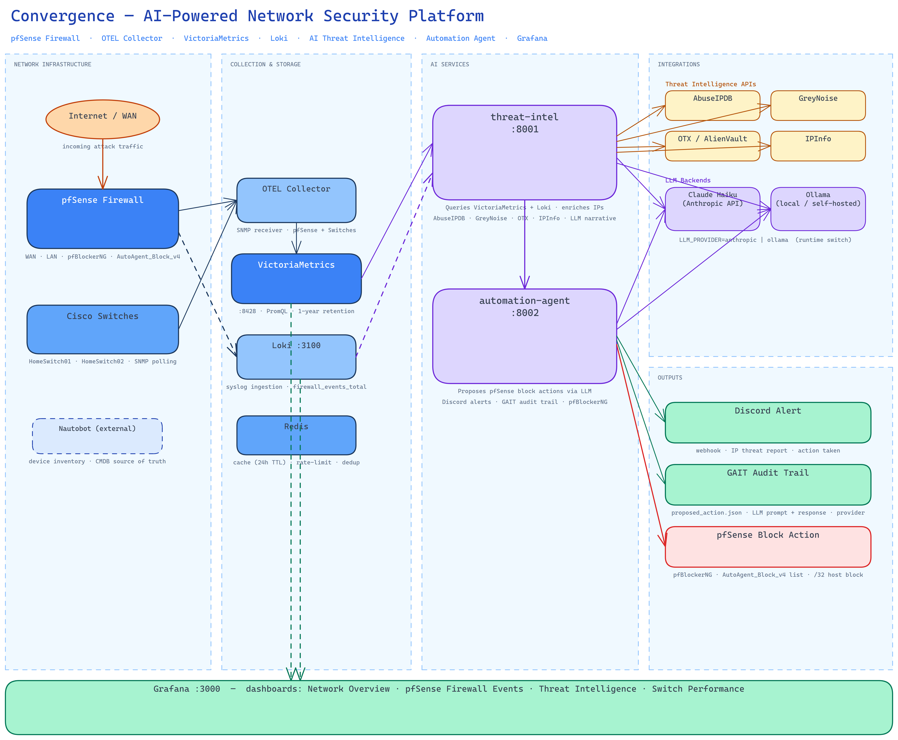

# Convergence

**Network Observability and AI Threat Intelligence Platform**

[](https://www.python.org/downloads/)
[](https://www.docker.com/)
[](docs/PROJECT_STATUS.md)

Convergence is a network observability platform built on OpenTelemetry Collector, VictoriaMetrics, Grafana, Loki, and Alertmanager. It collects, stores, visualizes, and alerts on telemetry from network devices, enriches pfSense firewall events with GeoIP and four threat intelligence APIs, and runs a multi-agent AI NOC team that continuously monitors the network using any LLM backend (Anthropic Claude, Ollama local, Ollama Cloud, or any OpenAI-compatible API). A unified LLM client provides automatic provider fallback, credential sanitization, and audit logging. A Discord bot provides in-channel slash-command approval for automation decisions and ad-hoc network questions routed to specialist agents. The platform includes automatic device discovery from Nautobot.

---

## ✨ Features

- **Automatic Device Discovery**: GraphQL-based integration with Nautobot for device inventory
- **Rich Metadata**: Every metric tagged with device hostname, IP, vendor, model, role, and site
- **Multiple Telemetry Sources**: SNMP, syslog (RFC 3164), with support for NETCONF, gNMI, and others
- **GeoIP Enrichment**: Source IP geolocation (lat/lon/country) for firewall events
- **Geo-Visualization**: Grafana Geomap panels showing real-time attack origins on a world map
- **AI Threat Intelligence**: Top blocked/outbound IPs enriched via AbuseIPDB, GreyNoise, OTX, and IPInfo
- **Composite Threat Scoring**: 0–100 score per IP with automatic threat level classification
- **Outbound C2 Detection**: Flags suspicious outbound destinations against threat intelligence feeds
- **AI Threat Narratives**: LLM generates pfSense-specific executive summaries and actionable remediation steps using real interface names and pfBlockerNG paths
- **Multi-Provider LLM Backend**: Unified client supporting Anthropic Claude, Ollama (local + cloud), and any OpenAI-compatible API (OpenRouter, vLLM, LiteLLM) — automatic fallback chain if primary provider fails
- **Credential Sanitization**: API keys, tokens, and passwords scrubbed from all tool results before reaching the LLM
- **LLM Audit Logging**: Every LLM call tracked with caller agent, provider, cloud vs local, prompt size, latency, and tool calls
- **Ollama Cloud Support**: Run 480B+ parameter models via Ollama Cloud while using the same local Ollama API — no GPU required
- **AI NOC Team**: 6 specialized agents (NOC Officer, Network Engineer, Security Expert, Security Engineer, NAS Engineer, Interface Reconciler) with domain-specific tools and system prompts
- **Dual LLM Backend**: Claude Haiku (Anthropic API) or any Ollama-hosted model — switch at runtime with a single env var (`LLM_PROVIDER=anthropic|ollama|openai`)
- **Event-Driven Automation**: Polls threat-intel every 10 minutes; LLM proposes pfSense blocking actions for high-risk IPs; executed live after human or auto approval
- **Discord Bot Approval**: Five slash commands (`/approve`, `/reject`, `/approve-all`, `/reject-all`, `/pending`) for in-channel human review of automation decisions
- **Repeat Offender Tracking**: Per-IP lifetime block counter in Redis; IPs blocked 5+ times or hammering 50+ events/hour get escalated durations and a permanent-block recommendation
- **GAIT Audit Trail**: Every AI decision committed to an immutable git branch — auto-approved sessions record 8 sequential JSON turns in one branch; human-approved sessions split across the original branch (scheduler turns 00–04) and a `{session_id}-approved` branch (approval + execution turns 00–03)
- **Pre-built Dashboards**: 9 Grafana dashboards across Network, Security, Threat Intelligence, and Automation folders
- **Intelligent Alerting**: Provisioned alert rules with Discord notifications via Alertmanager
- **Loki Ruler**: LogQL-based recording rules and spike detection for firewall events
- **Time-Series Storage**: VictoriaMetrics with configurable retention (default: 90 days)
- **Log Aggregation**: Loki + Promtail for structured log storage with label extraction
- **Self-signed SSL Support**: Development-friendly with certificate verification toggle
- **Extensible Architecture**: Add new receivers, processors, and exporters as needed

**Current Implementation**: ✅ **Operational** — Monitoring 2 Cisco switches + pfSense firewall via SNMP and syslog, AI threat intelligence enrichment, and live pfSense automation with Discord bot approval.

---

## 🚀 Quick Start

### Prerequisites

- Docker and Docker Compose
- Nautobot instance with API access (optional, for automatic device discovery)
- Network devices with SNMP/syslog enabled
- Python 3.12+ (for device discovery script)

### Installation

1. **Clone and configure:**
   ```bash
   git clone https://github.com/byrn-baker/convergence.git
   cd convergence

   # Copy and edit environment variables
   cp .env.example .env
   # Edit .env with your Nautobot URL, API token, SNMP community, and Discord webhook
   ```

2. **Start the stack:**
   ```bash
   docker compose up -d
   ```

3. **Discover devices from Nautobot (optional):**
   ```bash
   # List devices
   python3 scripts/nautobot_device_discovery.py --list-devices

   # Generate OTEL Collector configuration
   python3 scripts/nautobot_device_discovery.py --generate-config
   ```

4. **Update OTEL configuration:**
   - Copy the generated receivers and processors to `config/otel-collector/config.yaml`
   - Restart OTEL Collector: `docker compose restart otel-collector`

5. **Access Grafana:**
   - URL: http://localhost:3000
   - Default credentials: admin / admin
   - Dashboards are pre-loaded in the Network and Security folders

### Validation

```bash
# Check stack health
docker compose ps

# Verify metrics in VictoriaMetrics
curl http://localhost:8428/api/v1/label/device_name/values

# Check interface count
curl 'http://localhost:8428/api/v1/query?query=count(interface_in_octets_bytes_total)'

# Check Loki alerting rules
curl http://localhost:3100/loki/api/v1/rules

# Verify Alertmanager is healthy
curl http://localhost:9093/-/healthy
```

---

## 📊 Architecture



> **Editable source:** [docs/images/convergence-architecture.excalidraw](docs/images/convergence-architecture.excalidraw) — drag-and-drop into [excalidraw.com](https://excalidraw.com) to edit.

**Data flow summary:**

| Zone | Components | Role |
|------|-----------|------|
| Network Infrastructure | Internet/WAN · pfSense · Cisco Switches · Nautobot | Traffic sources and network inventory |
| Collection & Storage | OTEL Collector · VictoriaMetrics · Loki · Redis | Ingest metrics (SNMP) and logs (syslog), cache enrichment |
| AI Services | threat-intel `:8001` · automation-agent `:8002` | Enrich IPs, generate narratives, propose block actions |
| Integrations | AbuseIPDB · GreyNoise · OTX · IPInfo · Claude / Ollama | External threat intel APIs and LLM backends |
| Outputs | Discord Alert · GAIT Audit Trail · pfSense Block Action | Notifications, immutable audit log, firewall enforcement |
| Grafana `:3000` | 9 dashboards across Network, Security, Threat Intelligence, Automation folders | Unified observability UI |

---

## 📁 Project Structure

```
convergence/
├── config/
│   ├── otel-collector/
│   │   ├── config.yaml              # Main OTEL Collector configuration
│   │   └── receivers/
│   │       └── home-lab.yaml        # Device-specific SNMP receivers + processors
│   ├── victoriametrics/
│   │   └── prometheus.yml           # Scrape configuration
│   ├── loki/
│   │   ├── local-config.yaml        # Loki configuration (ruler enabled)
│   │   └── rules/
│   │       └── fake/
│   │           └── firewall_alerts.yaml  # LogQL recording + alerting rules
│   ├── promtail/
│   │   └── config.yaml              # Promtail log shipping + label extraction
│   ├── alertmanager/
│   │   └── alertmanager.yml         # Alert routing configuration
│   └── grafana/
│       └── provisioning/
│           ├── datasources/         # VictoriaMetrics + Loki data sources
│           ├── dashboards/          # Dashboard folder providers
│           └── alerting/
│               ├── alert_rules.yaml          # 5 provisioned alert rules
│               ├── contact_points.yaml       # Discord, Webhook, Email, Do Nothing
│               └── notification_policies.yaml # Routing tree → Discord
│
├── dashboards/
│   ├── network/
│   │   ├── interface-utilization.json
│   │   ├── interface-errors.json
│   │   ├── network-overview.json
│   │   ├── platform-health.json
│   │   └── device-health.json       # Uptime, error rates, bandwidth per device
│   ├── security/
│   │   ├── pfsense-firewall-security.json   # Geomap + firewall event analysis
│   │   └── threat-analysis.json             # Country breakdown, attack trends
│   ├── threat-intel/
│   │   └── threat-intelligence.json         # AI threat intelligence dashboard (Phase 4)
│   ├── automation/
│   │   └── automation-agent.json            # Automation agent dashboard (Phase 5)
│   ├── cisco/                       # Reserved for vendor-specific dashboards
│   ├── juniper/
│   └── arista/
│
├── services/
│   ├── threat-intel/                # Phase 4: AI threat intelligence microservice
│   │   ├── Dockerfile
│   │   ├── requirements.txt
│   │   ├── data/
│   │   │   └── port_services.json   # 31 high-risk port definitions
│   │   └── app/                     # FastAPI + APScheduler enrichment pipeline
│   │
│   ├── net-ops-team/               # Phase 7-8: AI NOC team with unified LLM client
│   │   ├── Dockerfile
│   │   ├── requirements.txt
│   │   └── app/
│   │       ├── main.py              # FastAPI + APScheduler (5min polls, hourly reports)
│   │       ├── config.py            # Pydantic settings (LLM provider, Ollama, OpenAI)
│   │       ├── models.py            # Finding, ShiftReport, AgentRole, Severity
│   │       ├── llm_client.py        # Unified LLM: multi-provider, fallback, sanitizer, audit
│   │       ├── team/
│   │       │   ├── supervisor.py        # Orchestrator — runs all agents, routes questions
│   │       │   ├── noc_officer.py       # L1 — health, uptime, anomalies
│   │       │   ├── network_engineer.py  # L2/L3 — switches, interfaces, utilization
│   │       │   ├── security_expert.py   # L2/L3 — firewall, NetFlow threat hunting
│   │       │   ├── security_engineer.py # L2/L3 — threat intel correlation
│   │       │   ├── nas_engineer.py      # L2/L3 — Synology health, RAID, disks
│   │       │   ├── interface_reconciler.py # Nautobot DCIM sync, port enrichment
│   │       │   └── discord_bot.py       # Discord bot — ad-hoc questions
│   │       └── tools/
│   │           ├── victoriametrics.py   # PromQL queries
│   │           ├── loki.py              # LogQL + NetFlow queries
│   │           ├── pfsense.py           # XML-RPC (DHCP leases, ARP table)
│   │           ├── nautobot.py          # GraphQL reads + REST writes
│   │           ├── switch_ssh.py        # Netmiko SSH to Cisco switches
│   │           └── discord_reporter.py  # Shift reports + alerts
│
├── netclaw/                         # Git submodule: automateyournetwork/netclaw
├── docker/
│   └── netclaw.Dockerfile           # Build recipe for NetClaw container
│
├── scripts/
│   ├── nautobot_device_discovery.py # Device discovery and config generation
│   └── setup-geoip.sh               # GeoIP database installer
│
├── docs/
│   ├── PROJECT_STATUS.md            # Detailed project status and history
│   ├── PHASE3_ALERTING.md           # Phase 3: alerting, geo-viz, dashboard guide
│   ├── PHASE4_THREAT_INTELLIGENCE.md # Phase 4: threat intel service deployment guide
│   ├── PHASE5_AUTOMATION_AGENT.md   # Phase 5: automation agent deployment + operations guide
│   ├── PHASE6_OLLAMA_PROVIDER.md    # Phase 6: Ollama LLM backend integration guide
│   ├── THREAT_INTEL_SERVICE.md      # Phase 4: service internals, API reference, gotchas
│   ├── FIREWALL-SECURITY-DASHBOARD.md
│   ├── NAUTOBOT_ENRICHMENT.md
│   ├── images/
│   │   ├── convergence-architecture.excalidraw  # Editable architecture diagram
│   │   └── convergence-architecture.png         # Rendered PNG
│   └── quickstart/
│
├── data/
│   ├── geoip/                       # MaxMind GeoLite2-City.mmdb
│   └── otelcol/                     # OTEL file exporter output (syslog.jsonl)
│
├── docker-compose.yml               # Docker services orchestration
├── .env.example                     # Environment variables template
├── validate_stack.sh                # Stack health validation
└── validate_nautobot.sh             # Nautobot integration validation
```

---

## 🔌 Service Access Points

| Service | URL | Credentials |
|---------|-----|-------------|
| Grafana | http://localhost:3000 | admin / admin |
| Threat Intel API | http://localhost:8001 | N/A |
| Automation Agent API | http://localhost:8002 | N/A |
| VictoriaMetrics API | http://localhost:8428 | N/A |
| Loki API | http://localhost:3100 | N/A |
| Alertmanager | http://localhost:9093 | N/A |
| NET-OPS Team API | http://localhost:8003 | N/A |
| NetClaw Gateway | http://localhost:18789 | N/A |
| Promtail Metrics | http://localhost:9080 | N/A |
| OTEL Collector Metrics | http://localhost:8888 | N/A |
| Redis | localhost:6379 | N/A (IP enrichment + automation cache) |

---

## 📈 Available Dashboards

### Network Folder

1. **Interface Utilization** — Traffic rates in bps, top interfaces, per-interface in/out graphs
2. **Interface Errors** — Error rates, top interfaces by errors, historical trends
3. **Network Overview** — Device count, total interfaces, platform-wide metrics
4. **Platform Health** — OTEL Collector, VictoriaMetrics, and service health metrics
5. **Network Device Health** *(new)*
   - Per-device uptime stats with colour thresholds (green ≥1d, orange ≥10m, red <10m)
   - Uptime history timeseries — drops to near-zero indicate reboots
   - Interface error rates (table + timeseries, only shows interfaces with active errors)
   - Total bandwidth per device (IN + OUT in bps)

### Security Folder

6. **pfSense Firewall Security**
   - Geomap: WAN threats — blocked IPs plotted by source lat/lon, sized by block count
   - Geomap: Traffic destinations
   - Top 100 blocked source IPs table
   - Firewall actions over time (pass vs block)
   - Protocol and interface distribution

7. **Threat Analysis** *(new in Phase 3)*
   - Stats: total blocks (24h), attacking countries, current block rate (blocks/min)
   - Top 10 attacking countries (horizontal bar chart)
   - Protocol distribution (donut chart)
   - Attack rate by country over time (top 7, 15m rolling rate)
   - Blocks by interface (stacked timeseries)
   - Full sortable country breakdown table

### Threat Intelligence Folder *(Phase 4)*

8. **AI Threat Intelligence**
   - Executive Summary strip: overall risk level, known bad actor counts, critical ports, max threat score gauge, last enrichment timestamp
   - AI Narrative row: Claude Haiku executive summary, pfSense-specific recommended actions (with real interface names and pfBlockerNG paths), top threats with org/false positive context
   - Inbound Threat Scores: top IPs by composite score, AbuseIPDB scores, score over time
   - Outbound Traffic Analysis: suspicious outbound destinations (with pfSense NAT source), OTX hits
   - Port Attack Analysis: top targeted ports bar chart, critical ports table, risk level pie chart
   - Enriched IP Detail Tables: full blocked IP and outbound IP tables with country, org, score, AbuseIPDB, GreyNoise, OTX columns
   - Service Health: last enrichment timestamp, IPs processed, cache hit rate

### Automation Folder *(Phase 5)*

9. **Automation Agent**
   - Sessions table: recent automation sessions with IP, threat score, proposed action, status, timestamp
   - Pending Approvals: IPs awaiting Discord bot approval (auto-refreshes)
   - Action Metrics: automation actions taken (success/fail/dry-run), actions per hour gauge vs. `MAX_ACTIONS_PER_HOUR` cap
   - GAIT Audit: list of git audit branches created this session (one per IP decision)
   - Agent Health: scheduler poll status, Redis connectivity, last poll timestamp

---

## 🔔 Alerting

Five provisioned alert rules evaluate every 1–2 minutes:

### Security Alerts
| Rule | Condition |
|------|-----------|
| High Block Rate From Country (1h) | >1000 blocks from one country in 1h |
| Firewall Block Rate Spike (5m) | >500 total blocks in 5m |

### Network Health Alerts
| Rule | Condition |
|------|-----------|
| Network Switch Rebooted | Uptime counter drops (negative delta) |
| Network Switch Low Uptime | Any switch uptime <10 minutes |
| Network Device SNMP Unreachable | No SNMP data for >5 minutes |

All alerts route to **Discord** by default. Set `DISCORD_WEBHOOK_URL` in `.env` and run:
```bash
docker compose up -d --force-recreate grafana
```

Test the Discord contact point:
```bash
curl -s -u admin:admin \
  -X POST http://localhost:3000/api/v1/provisioning/contact-points/convergence-discord/test \
  -H "Content-Type: application/json" -d '{}'
```

See [docs/PHASE3_ALERTING.md](docs/PHASE3_ALERTING.md) for full alerting documentation.

---

## 📖 Documentation

For detailed information, see the [docs](docs/) folder:

- **[Project Status](docs/PROJECT_STATUS.md)**: Current capabilities, recent improvements, lessons learned, and roadmap
- **[Phase 8: Unified LLM Client](docs/PHASE8_LLM_ABSTRACTION.md)**: Multi-provider LLM abstraction — Anthropic/Ollama/OpenAI fallback chain, credential sanitization, audit logging, Ollama Cloud, NetClaw submodule
- **[Phase 7: Network Operations Team](docs/PHASE7_NETWORK_OPS_TEAM.md)**: Multi-agent AI NOC team — 6 specialist agents, Discord integration, Nautobot DCIM writes, NetFlow pipeline
- **[Phase 6: Ollama LLM Provider](docs/PHASE6_OLLAMA_PROVIDER.md)**: Ollama integration guide — why the native `/api/chat` endpoint is required for thinking models, `LLM_PROVIDER` runtime switching, model recommendations, and troubleshooting
- **[Phase 5: Automation Agent](docs/PHASE5_AUTOMATION_AGENT.md)**: Complete deployment and operations guide — pfSense XML-RPC setup, Discord bot configuration, safety controls, repeat offender tracking, GAIT audit trail, and troubleshooting
- **[Phase 4: AI Threat Intelligence](docs/PHASE4_THREAT_INTELLIGENCE.md)**: Deployment guide, composite scoring, Grafana dashboard, Loki port analysis, troubleshooting, and bug reference for the threat-intel service
- **[Threat Intel Service Reference](docs/THREAT_INTEL_SERVICE.md)**: Service internals, enrichment pipeline data flow, all 15 API endpoints with examples, Redis key schema, Infinity datasource gotchas, and development notes
- **[Phase 3 Alerting Guide](docs/PHASE3_ALERTING.md)**: Alerting pipeline, geo-visualization, dashboard organization, and troubleshooting
- **[Nautobot Integration](docs/NAUTOBOT_ENRICHMENT.md)**: Setup guide for Nautobot API integration
- **[Firewall Dashboard Example](docs/FIREWALL-SECURITY-DASHBOARD.md)**: pfSense integration guide
- **[Quick Start Guide](docs/quickstart/)**: Step-by-step deployment instructions

---

## 🛠️ Configuration

### Environment Variables

Key variables in `.env`:

```bash
# Nautobot Configuration (optional)
NAUTOBOT_URL=https://your-nautobot-instance
NAUTOBOT_TOKEN=your-api-token-here
NAUTOBOT_VERIFY_SSL=false  # For self-signed certificates

# SNMP Configuration
SNMP_COMMUNITY=public

# MaxMind GeoIP (required for geographic threat visualization)
# Run scripts/setup-geoip.sh to download the database
MAXMIND_ACCOUNT_ID=your_account_id
MAXMIND_LICENSE_KEY=your_license_key

# VictoriaMetrics
VM_RETENTION_PERIOD=90d

# Grafana
GRAFANA_ADMIN_PASSWORD=admin

# Alerting — Discord webhook for alert notifications
# Server Settings → Integrations → Webhooks → New Webhook → Copy URL
DISCORD_WEBHOOK_URL=https://discord.com/api/webhooks/YOUR_ID/YOUR_TOKEN

# Generic webhook (Slack, n8n, custom endpoint)
# ALERT_WEBHOOK_URL=https://hooks.slack.com/services/...

# Threat Intelligence API keys (Phase 4)
# See docs/PHASE4_THREAT_INTELLIGENCE.md for registration links and free tier limits
ANTHROPIC_API_KEY=sk-ant-...        # Required when LLM_PROVIDER=anthropic
ABUSEIPDB_API_KEY=                  # Recommended: 1,000 checks/day free
OTX_API_KEY=                        # Recommended: free registration
IPINFO_TOKEN=                       # Recommended: 50k lookups/month free
GREYNOISE_API_KEY=                  # Optional: community API works without key

# LLM provider (Phase 8) — default: anthropic
# Supports: anthropic, ollama (local + cloud), openai (any OpenAI-compatible API)
# LLM_PROVIDER=ollama
# OLLAMA_BASE_URL=http://host.docker.internal:11434
# OLLAMA_MODEL=qwen3-coder:480b-cloud  # Use -cloud suffix for Ollama Cloud models

# OpenAI-compatible API (OpenRouter, vLLM, LiteLLM, etc.)
# LLM_PROVIDER=openai
# OPENAI_BASE_URL=https://openrouter.ai/api
# OPENAI_API_KEY=sk-or-v1-...
# OPENAI_MODEL=qwen/qwen3-30b-a3b
```

See [.env.example](.env.example) for all available options.

### Important: Applying Environment Variable Changes

`docker compose restart` does **not** apply env var changes. Use `--force-recreate`:
```bash
docker compose up -d --force-recreate grafana
```

---

## 🔄 Workflow: Adding New Devices

1. **Add device to Nautobot:**
   - Create device with primary IPv4 address
   - Set device type, manufacturer, role, and location
   - Ensure status is "Active"

2. **Generate configuration:**
   ```bash
   python3 scripts/nautobot_device_discovery.py --generate-config
   ```

3. **Update OTEL Collector:**
   - Add generated receivers and processors to `config/otel-collector/receivers/home-lab.yaml`
   - The pipeline in `config.yaml` already includes new receivers automatically

4. **Restart collector:**
   ```bash
   docker compose restart otel-collector
   ```

5. **Verify in Grafana:**
   - Check Network Overview and Network Device Health dashboards
   - Confirm device appears with correct metadata

---

## 🧪 Testing & Validation

```bash
# Full stack validation
./validate_stack.sh

# Nautobot connectivity test
./validate_nautobot.sh

# Check discovered devices
python3 scripts/nautobot_device_discovery.py --list-devices

# Query VictoriaMetrics
curl 'http://localhost:8428/api/v1/label/device_name/values'
curl 'http://localhost:8428/api/v1/query?query=system_uptime_seconds'

# Check Loki ruler rules
curl http://localhost:3100/loki/api/v1/rules

# List Grafana alert rules
curl -s -u admin:admin http://localhost:3000/api/v1/provisioning/alert-rules | \
  python3 -c "import sys,json; [print(r['uid'],'-',r['title']) for r in json.load(sys.stdin)]"

# Verify Discord contact point loaded
curl -s -u admin:admin http://localhost:3000/api/v1/provisioning/contact-points | \
  python3 -c "import sys,json; [print(f['name'],'-',f['type']) for f in json.load(sys.stdin)]"
```

---

## 🎯 Current Status

### ✅ Working Features
- Automatic device discovery from Nautobot (GraphQL)
- SNMP monitoring: 2 Cisco switches + pfSense firewall (uptime, interfaces, bandwidth, errors)
- Full device metadata enrichment (name, IP, vendor, model, role, site)
- Real interface names (e.g., "GigabitEthernet1/0/1")
- pfSense syslog ingestion with filterlog parsing and GeoIP enrichment
- `firewall_events_total` metric with geo labels (src_lat, src_lon, src_country)
- AI threat intelligence: top 50 blocked + 20 outbound IPs enriched hourly via 4 external APIs
- Composite 0–100 threat scoring with outbound C2 detection and false positive heuristics
- Claude Haiku AI narratives: pfSense-specific executive summary, top threats, recommended actions
- 10 `threat_intel_*` Prometheus metrics flowing into VictoriaMetrics
- 9 Grafana dashboards in Network, Security, Threat Intelligence, and Automation folders
- Loki ruler: LogQL recording rules and spike detection alerting
- 5 provisioned Grafana alert rules (security + network health)
- Discord alerting via Alertmanager and Grafana Unified Alerting
- 90-day metrics retention in VictoriaMetrics
- Redis caching: 24h TTL per IP, AbuseIPDB daily budget guard
- **Live automation**: polling threat-intel every 10m, Claude-proposed pfSense blocks via XML-RPC
- **Discord bot approval**: `/approve`, `/reject`, `/approve-all`, `/reject-all`, `/pending` slash commands with human-bypassed rate limits
- **Repeat offender tracking**: per-IP lifetime block counter; escalated TTL (168h) + permanent block recommendation at 5+ blocks or 50+ events/hour
- **GAIT audit trail**: every AI decision committed to an immutable git branch; Discord bot approvals now create a proper `{session_id}-approved` branch recording the full execution trail (approval → execution_result → verification → outcome)
- **Phase 8: Unified LLM Client** — Multi-provider abstraction (Anthropic/Ollama/OpenAI), automatic fallback, credential sanitization, audit logging, Ollama Cloud support, NetClaw git submodule
- **Ollama LLM support**: all three AI services (threat-intel, automation-agent, net-ops-team) support local Ollama models, Ollama Cloud models, and any OpenAI-compatible API; `LLM_PROVIDER=ollama|anthropic|openai` runtime switch — no rebuild required

### 🎯 Roadmap

Phase 1–6 complete. Potential future enhancements:

- Dynamic baselines: MetricsQL `outlier_iqr_over_time()` to replace fixed alert thresholds
- Multi-site: extend Alertmanager routing for multiple pfSense instances
- Additional protocols: NETCONF, gNMI
- Persistent permanent block list: automatic promotion from temp block list after repeat offender threshold

See [docs/PROJECT_STATUS.md](docs/PROJECT_STATUS.md) for detailed history and roadmap.

---

## 💡 Example Use Cases

The platform can be adapted for various observability scenarios:

1. **Network Device Monitoring** *(Current Primary Use)*
   - SNMP polling of switches, routers, firewalls
   - Interface utilization and error tracking
   - Device health and uptime monitoring with reboot detection

2. **Firewall/Security Monitoring** *(Implemented)*
   - Syslog ingestion from pfSense
   - Log parsing, GeoIP enrichment, log-to-metrics conversion
   - Geographic threat visualization with real-time Geomap panels
   - Country-based attack analysis and spike alerting to Discord

3. **Application Monitoring** *(Potential)*
   - OTLP metrics from applications
   - Log aggregation from services
   - Custom metric collection

4. **Infrastructure Monitoring** *(Potential)*
   - System metrics from servers
   - Container metrics from Docker/Kubernetes
   - Cloud resource monitoring

---

## 🤝 Contributing

Contributions welcome! If you encounter issues or have improvements:

1. Check [docs/PROJECT_STATUS.md](docs/PROJECT_STATUS.md) for known limitations
2. Document your environment and steps to reproduce
3. Include relevant logs and error messages
4. Submit detailed bug reports or pull requests

---

## 📝 License

MIT License - See [LICENSE](LICENSE) file for details.

---

## 🙏 Acknowledgments

- Built with [OpenTelemetry Collector](https://opentelemetry.io/docs/collector/)
- Powered by [VictoriaMetrics](https://victoriametrics.com/)
- Visualized with [Grafana](https://grafana.com/)
- Integrated with [Nautobot](https://nautobot.com/)
- Log aggregation with [Grafana Loki](https://grafana.com/oss/loki/)
- Alert routing with [Prometheus Alertmanager](https://prometheus.io/docs/alerting/latest/alertmanager/)

---

**Need Help?** Check the [documentation](docs/) folder. For automation agent issues see [PHASE5_AUTOMATION_AGENT.md](docs/PHASE5_AUTOMATION_AGENT.md#troubleshooting). For threat intelligence issues see [PHASE4_THREAT_INTELLIGENCE.md](docs/PHASE4_THREAT_INTELLIGENCE.md#troubleshooting). For alerting and firewall issues see [PHASE3_ALERTING.md](docs/PHASE3_ALERTING.md).
